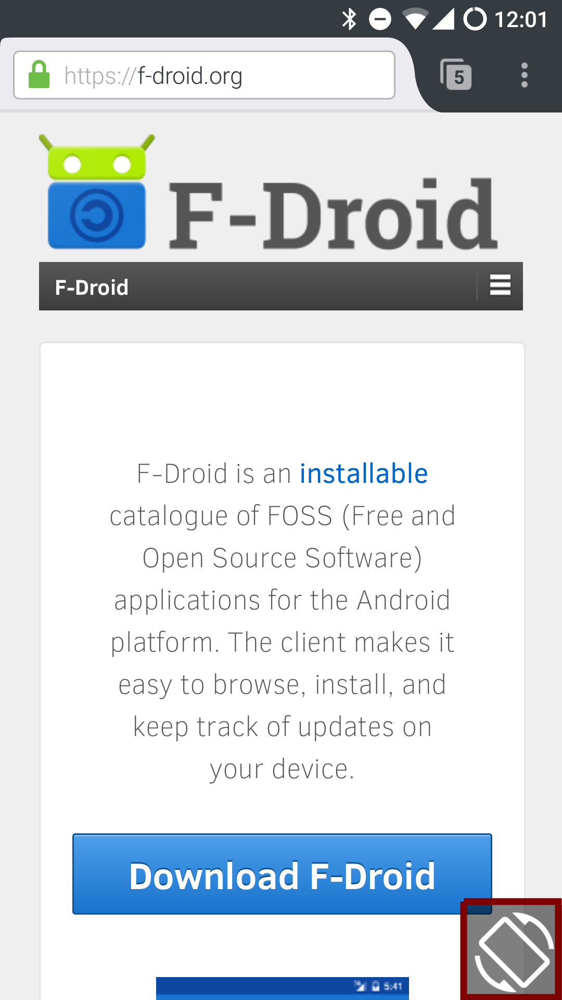
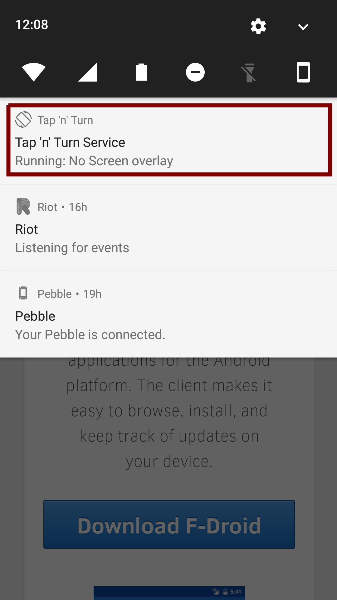
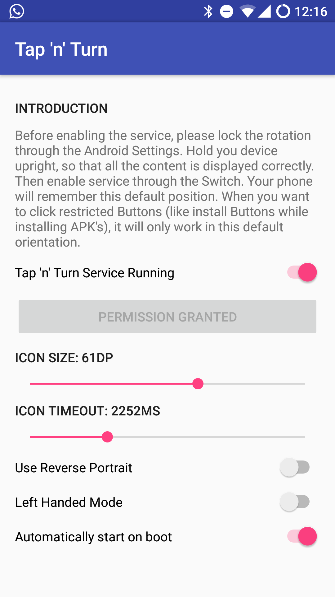

## Introduction
**Tap'n'Turn** is a small utility that has been created to help you to manage your screen orientation. Android offers you two options: *lock* or *auto rotate*. Depending on your usage, that might be sufficient. However, there are usecases, when auto-rotation kicks in in the wrong moment, for example when lying horizontally in your bed. Disabling auto rotation altogether doesn't work for showing fotos to your relatives.

**Tap'n'Turn** aims to solve this problem by asking you directly when you physically rotate your device, if your intention is to change the logical screen orientation as well. It does so by displaying a little unintrusive icon in one of the corners which you can click to match the logical screen orientation to the physical screen orientation.

## Get the App

## Screenshots

## Get in Touch
Feel free to participate in any way. Translate the app, create ideas and submit patches. There is the [Issue Tracker](https://github.com/gabm/TapAndTurn/issues) as the central place to track bugs. Further we have a [riot.im](https://riot.im) channel under `#TapAndTurn:matrix.org`.

## License
The source code of **Tap'n'Turn** is released to public domain under the terms of the [GPLv3](https://www.gnu.org/licenses/gpl-3.0.en.html) or newer. 

The trademarks **Tap'n'Turn** as well as similar identifiers like **TapAndTurn**, **Tap and Turn** are owned by Matthias Gabriel. All rights are reserved. The preferred written from is **Tap'n'Turn**. These trademarks are used to refer to the source code, the binary releases as well as the community (herafter: *the Project*). You are granted the right to use these trademarks to refer to *the Project* in dicussions, documentations and written publications. You may not use these trademarks for binary releases without permit by the original author. If you want to distribute derived work, you have to use a different name.

## Contact
You can contact me via mail `gabmtuc <at> gmail <dot> com` or at [riot.im](https://riot.im) under `@gabm:matrix.org`.

